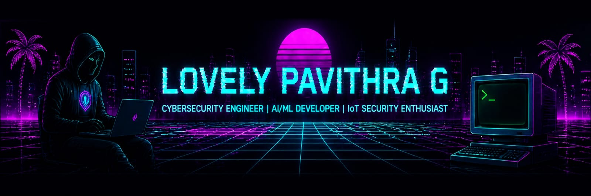

<!-- ================== NEON BANNER ================== -->

  

<!-- ================== CYBER HEADER ================== -->

  

---

<!-- ================== DNA DIVIDER ================== -->---

🧠 Tech Stack

  

---

🤖 AI / ML / DL Modules

Libraries
TensorFlow • PyTorch • Scikit-learn • Keras

Data
Pandas • NumPy

Visualization
Matplotlib • Plotly • SciPy

Concepts
CNN • RNN • LSTM • NLP • Random Forest • KNN

---

🔐 Cybersecurity

Skills
SQL Injection • Web Security Basics • System-Level Thinking • IoT Security Concepts

Focus
AI-based Intrusion Detection • Explainable Security Systems

Tools
Nmap • Wireshark • OWASP ZAP • John the Ripper

---

<!-- ================== DNA DIVIDER ================== -->---

⚡ GitHub Analytics

  
  

  

  

---

<!-- ================== DNA DIVIDER ================== -->---

🚀 Currently Working On

🧠 NeuroXis-IDS

AI Powered Intrusion Detection System (IoT Security)

- 🔍 Real-time anomaly detection
- 🧠 Explainable AI (XAI)
- 🔗 Blockchain logging (planned)
- ⚡ Scalable architecture

---

<!-- ================== DNA DIVIDER ================== -->---

🌐 Connect

---

🖥 Terminal

> The only thing standing between you and your goal
> is the story you keep telling yourself.
